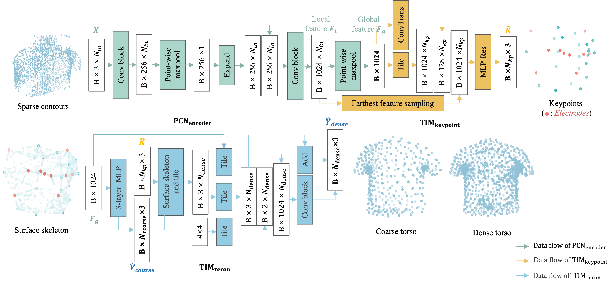
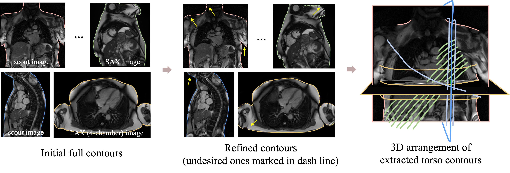

# Topolgy-Informed-Electrode-Localizer

Code for the localization of standard 12-lead ECG electrodes from cardiac MRIs. This is achieved via a topology-informed model, where the electrodes have been incorporated as a subset of the keypoints to explicitly aligned with the 3D torso topology.



## Package dependencies:<a id="Package dependencies"/>
This repository is based on PyTorch, running on a computer with 2.1~GHz 13th Gen Intel(R) Core(TM) i7-13700 CPU and an NVIDIA GeForce RTX 3070.

## Dataset:<a id="Dataset"/>
Our network is trained based on UKB dataset, which contains paired multi-view cardiac MRIs. 
The acquisition process begins with scout images, also known as localizers, providing partial coverage of the torso in sagittal, transverse, and coronal planes.
These images guide the placement and alignment of focused cardiac scans, which include three long-axis (LAX) cine sequences (2-, 3-, and 4-chamber views) and a stack of short-axis (SAX) balanced steady-state free precession (bSSFP) cines.
Here, we employed both heart-focused bSSFP cine images at the end-diastolic (ED) phase and the localizers to extract the torso contours.



The data folder should be like:
```
tree
`-- data_mesh
    `-- patientID
    |    |-- torso_contour.vtk
    |    |-- torso_mesh.vtk
    |    |-- electrodes_gd.vtk
		
```

## Citation:<a id="Citation"/>
If you find this code useful in your research, please consider citing:
```
@article{jounral/MedIA/li2025,
  title={Towards Enabling Cardiac Digital Twins of Myocardial Infarction Using Deep Computational Models for Inverse Inference},
  author={Li, Lei and Camps, Julia and Wang, Zhinuo and Banerjee, Abhirup and Rodriguez, Blanca and Grau, Vicente},
  journal={IEEE Transactions on Medical Imaging},
  year={2024}
}

```
